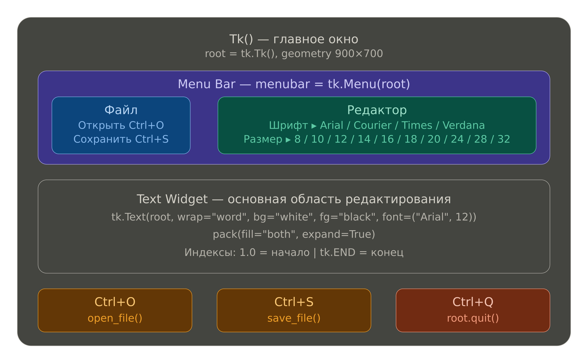
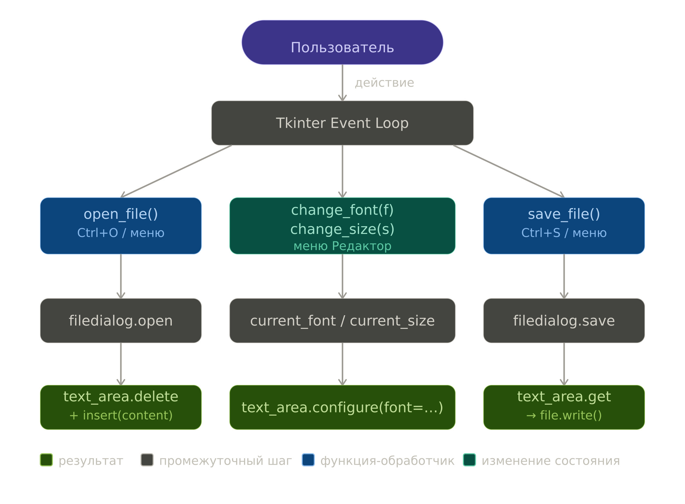

# 📝 Простой текстовый редактор на Python + Tkinter

> Учебный проект: создание полнофункционального текстового редактора (аналог Блокнота) с нуля.

---

## 📚 Содержание

1. [Введение и цель проекта](#1-введение-и-цель-проекта)
2. [Исследование предметной области](#2-исследование-предметной-области)
3. [Архитектура приложения](#3-архитектура-приложения)
4. [Пошаговое техническое руководство](#4-пошаговое-техническое-руководство)
   - [Этап 1 — Базовая структура](#этап-1--базовая-структура)
   - [Этап 2 — Работа с файлами](#этап-2--работа-с-файлами)
   - [Этап 3 — Меню и шрифты](#этап-3--меню-и-шрифты)
   - [Этап 4 — Горячие клавиши](#этап-4--горячие-клавиши)
   - [Этап 5 — Финальная сборка](#этап-5--финальная-сборка)
5. [Полный исходный код](#5-полный-исходный-код)
6. [Как запустить проект](#6-как-запустить-проект)
7. [Итоги и выводы](#7-итоги-и-выводы)

---

## 1. Введение и цель проекта

Цель проекта — создать **простой текстовый редактор** с графическим интерфейсом на языке Python, используя встроенную библиотеку **Tkinter**. Редактор должен:

- открывать и сохранять текстовые файлы;
- поддерживать смену шрифта и его размера;
- работать на Windows, macOS и Linux без установки дополнительных пакетов;
- иметь чистый, интуитивно понятный интерфейс.

Проект рассчитан на **начинающих** разработчиков, знакомых с базовым синтаксисом Python.

---

## 2. Исследование предметной области

### 2.1 Что такое Tkinter?

**Tkinter** — стандартный модуль Python для создания графических интерфейсов (GUI). Он входит в комплект поставки Python и не требует отдельной установки.

```
Python → Tkinter → Tcl/Tk → Native OS Window
```

Ключевые понятия Tkinter:

| Понятие | Описание |
|---|---|
| `Tk()` | Главное окно приложения |
| `Widget` | Элемент интерфейса (кнопка, поле ввода и т.д.) |
| `Pack / Grid / Place` | Менеджеры компоновки виджетов |
| `Mainloop` | Цикл обработки событий (Event Loop) |
| `Bind` | Привязка функции к событию клавиатуры/мыши |
| `Menu` | Виджет для создания меню |
| `filedialog` | Диалоговые окна открытия/сохранения файлов |

### 2.2 Почему Tkinter, а не другие библиотеки?

Сравнение популярных GUI-библиотек для Python:

| Библиотека | Установка | Сложность | Кроссплатформенность |
|---|---|---|---|
| **Tkinter** | Встроена в Python | Низкая | ✅ Отличная |
| PyQt5/PySide6 | `pip install` | Высокая | ✅ Отличная |
| wxPython | `pip install` | Средняя | ✅ Хорошая |
| Dear PyGui | `pip install` | Средняя | ✅ Хорошая |

**Вывод**: Tkinter — оптимальный выбор для учебных проектов и быстрого прототипирования.

### 2.3 Аналоги: что умеет «Блокнот»?

Исследование функциональности аналогов (Notepad, gedit, Mousepad) показало минимально необходимый набор функций:

- [x] Ввод и редактирование текста
- [x] Открытие файла
- [x] Сохранение файла
- [x] Смена шрифта
- [x] Горячие клавиши

---

## 3. Архитектура приложения

### 3.1 Структура файлов

```
text-editor/
│
├── editor.py          # Основной файл приложения
└── README.md          # Документация (этот файл)
```

### 3.2 Схема компонентов



### 3.3 Поток данных (Event Flow)



## 4. Пошаговое техническое руководство

### Предварительные требования

- Python 3.7 или выше (скачать на [python.org](https://python.org))
- Tkinter входит в стандартную поставку Python
- Любой текстовый редактор или IDE (VS Code, PyCharm, IDLE)

Проверьте установку:
```bash
python --version        # Должно быть Python 3.7+
python -c "import tkinter; print('Tkinter OK')"
```

---

### Этап 1 — Базовая структура

**Цель:** Создать окно с текстовой областью.

Создайте файл `editor.py` и напишите:

```python
import tkinter as tk

# Создаём главное окно
root = tk.Tk()
root.title("Простой редактор")
root.geometry("900x700")   # Размер окна: ширина x высота
root.configure(bg="white") # Белый фон

# Текстовая область — сердце редактора
text_area = tk.Text(
    root,
    wrap="word",    # Перенос по словам
    bg="white",     # Белый фон
    fg="black",     # Чёрный текст
    font=("Arial", 12)
)
text_area.pack(fill="both", expand=True)  # Растягиваем на всё окно

# Запускаем главный цикл событий
root.mainloop()
```

Запустите: `python editor.py` — вы увидите чистое окно с текстовым полем.

**Что здесь происходит:**
- `tk.Tk()` — создаёт главное окно операционной системы
- `tk.Text()` — многострочное поле для ввода текста (в отличие от `Entry`, которое однострочное)
- `pack(fill="both", expand=True)` — говорит менеджеру компоновки растянуть виджет на всё доступное место
- `mainloop()` — запускает бесконечный цикл обработки событий (кликов, нажатий клавиш)

---

### Этап 2 — Работа с файлами

**Цель:** Добавить функции открытия и сохранения файлов.

Добавьте в файл после создания `text_area` и до `root.mainloop()`:

```python
from tkinter import filedialog  # Добавьте в начало файла!

# Глобальные переменные для шрифта
current_font = "Arial"
current_size = 12

def open_file():
    """Открывает диалог выбора файла и загружает его содержимое"""
    file_path = filedialog.askopenfilename(
        filetypes=[
            ("Text files", "*.txt"),   # Показывать .txt файлы
            ("All files", "*.*")        # Или все файлы
        ]
    )
    
    if file_path:  # Если пользователь выбрал файл (не нажал Cancel)
        with open(file_path, "r", encoding="utf-8") as file:
            content = file.read()
            text_area.delete(1.0, tk.END)  # Очищаем текущее содержимое
            text_area.insert(tk.END, content)  # Вставляем новое

def save_file():
    """Открывает диалог сохранения и записывает текст в файл"""
    file_path = filedialog.asksaveasfilename(
        defaultextension=".txt",  # Расширение по умолчанию
        filetypes=[
            ("Text files", "*.txt"),
            ("All files", "*.*")
        ]
    )
    
    if file_path:  # Если пользователь не нажал Cancel
        with open(file_path, "w", encoding="utf-8") as file:
            # Получаем текст: от начала (1.0) до конца (tk.END)
            file.write(text_area.get(1.0, tk.END))
```

> ⚠️ **Важно про индексы в `Text`:** Tkinter использует особую нумерацию позиций. `1.0` означает «строка 1, символ 0» (начало файла). `tk.END` — конец содержимого.

---

### Этап 3 — Меню и шрифты

**Цель:** Добавить меню и функции смены шрифта.

```python
def change_font(f):
    """Меняет шрифт, сохраняя текущий размер"""
    global current_font
    current_font = f
    text_area.configure(font=(current_font, current_size))

def change_size(s):
    """Меняет размер шрифта, сохраняя текущий шрифт"""
    global current_size
    current_size = s
    text_area.configure(font=(current_font, current_size))

# ==================== Меню ====================
menubar = tk.Menu(root)
root.config(menu=menubar)  # Прикрепляем меню к окну

# --- Подменю «Файл» ---
file_menu = tk.Menu(menubar, tearoff=0)  # tearoff=0 — нельзя «оторвать» меню
menubar.add_cascade(label="Файл", menu=file_menu)
file_menu.add_command(label="Открыть",  command=open_file,  accelerator="Ctrl+O")
file_menu.add_command(label="Сохранить", command=save_file, accelerator="Ctrl+S")
file_menu.add_separator()  # Горизонтальная линия
file_menu.add_command(label="Выход", command=root.quit, accelerator="Ctrl+Q")

# --- Подменю «Редактор» ---
edit_menu = tk.Menu(menubar, tearoff=0)
menubar.add_cascade(label="Редактор", menu=edit_menu)

# Вложенное подменю шрифтов
font_menu = tk.Menu(edit_menu, tearoff=0)
edit_menu.add_cascade(label="Шрифт", menu=font_menu)
font_menu.add_command(label="Arial",   command=lambda: change_font("Arial"))
font_menu.add_command(label="Courier", command=lambda: change_font("Courier"))
font_menu.add_command(label="Times",   command=lambda: change_font("Times"))
font_menu.add_command(label="Verdana", command=lambda: change_font("Verdana"))

# Вложенное подменю размеров — генерируем автоматически!
size_menu = tk.Menu(edit_menu, tearoff=0)
edit_menu.add_cascade(label="Размер", menu=size_menu)
for sz in [8, 10, 12, 14, 16, 18, 20, 24, 28, 32]:
    # lambda s=sz нужен, чтобы захватить текущее значение sz в замыкании
    size_menu.add_command(label=str(sz), command=lambda s=sz: change_size(s))
```

> ⚠️ **Ловушка с `lambda` в цикле:** Если написать `lambda: change_size(sz)`, все пункты меню будут вызывать `change_size` с последним значением `sz` (32). Запись `lambda s=sz: change_size(s)` фиксирует текущее значение переменной.

---

### Этап 4 — Горячие клавиши

**Цель:** Привязать функции к сочетаниям клавиш.

```python
# ==================== Горячие клавиши ====================
# bind() связывает событие с функцией-обработчиком
# lambda event: ... нужен, потому что bind передаёт объект event в функцию

root.bind("<Control-o>", lambda event: open_file())
root.bind("<Control-s>", lambda event: save_file())
root.bind("<Control-q>", lambda event: root.quit())
```

> **Совет:** Строки событий Tkinter всегда в угловых скобках. Примеры:
> - `<Control-c>` — Ctrl+C
> - `<Return>` — Enter
> - `<Button-1>` — левая кнопка мыши
> - `<KeyRelease-a>` — отпускание клавиши «a»

---

### Этап 5 — Финальная сборка

Теперь объединяем всё в один файл. Полный исходный код — в разделе 5.

**Дополнительные улучшения, которые можно добавить:**

```python
# Включить режим Undo/Redo (отмена действий)
text_area = tk.Text(..., undo=True)
root.bind("<Control-z>", lambda e: text_area.edit_undo())
root.bind("<Control-y>", lambda e: text_area.edit_redo())

# Добавить полосу прокрутки
scrollbar = tk.Scrollbar(root, command=text_area.yview)
scrollbar.pack(side="right", fill="y")
text_area.configure(yscrollcommand=scrollbar.set)

# Показывать текущий файл в заголовке окна
root.title(f"Редактор — {file_path}")
```

---

## 5. Полный исходный код

```python
import tkinter as tk
from tkinter import filedialog, font

root = tk.Tk()
root.title("Простой редактор")
root.geometry("900x700")
root.configure(bg="white")

text_area = tk.Text(root, wrap="word", bg="white", fg="black", font=("Arial", 12))
text_area.pack(fill="both", expand=True)

current_font = "Arial"
current_size = 12

def open_file():    
    file_path = filedialog.askopenfilename(
        filetypes=[("Text files", "*.txt"), ("All files", "*.*")]
    )
    if file_path:
        with open(file_path, "r", encoding="utf-8") as file:
            content = file.read()
            text_area.delete(1.0, tk.END)
            text_area.insert(tk.END, content)

def save_file():
    file_path = filedialog.asksaveasfilename(
        defaultextension=".txt",
        filetypes=[("Text files", "*.txt"), ("All files", "*.*")]
    )
    if file_path:
        with open(file_path, "w", encoding="utf-8") as file:
            file.write(text_area.get(1.0, tk.END))

def change_font(f):
    global current_font
    current_font = f
    text_area.configure(font=(current_font, current_size))

def change_size(s):
    global current_size
    current_size = s
    text_area.configure(font=(current_font, current_size))

# ==================== Меню ====================
menubar = tk.Menu(root)
root.config(menu=menubar)

file_menu = tk.Menu(menubar, tearoff=0)
menubar.add_cascade(label="Файл", menu=file_menu)
file_menu.add_command(label="Открыть",  command=open_file,  accelerator="Ctrl+O")
file_menu.add_command(label="Сохранить", command=save_file, accelerator="Ctrl+S")
file_menu.add_separator()
file_menu.add_command(label="Выход", command=root.quit, accelerator="Ctrl+Q")

edit_menu = tk.Menu(menubar, tearoff=0)
menubar.add_cascade(label="Редактор", menu=edit_menu)

font_menu = tk.Menu(edit_menu, tearoff=0)
edit_menu.add_cascade(label="Шрифт", menu=font_menu)
font_menu.add_command(label="Arial",   command=lambda: change_font("Arial"))
font_menu.add_command(label="Courier", command=lambda: change_font("Courier"))
font_menu.add_command(label="Times",   command=lambda: change_font("Times"))
font_menu.add_command(label="Verdana", command=lambda: change_font("Verdana"))

size_menu = tk.Menu(edit_menu, tearoff=0)
edit_menu.add_cascade(label="Размер", menu=size_menu)
for sz in [8, 10, 12, 14, 16, 18, 20, 24, 28, 32]:
    size_menu.add_command(label=str(sz), command=lambda s=sz: change_size(s))

# ==================== Горячие клавиши ====================
root.bind("<Control-o>", lambda event: open_file())
root.bind("<Control-s>", lambda event: save_file())
root.bind("<Control-q>", lambda event: root.quit())

root.mainloop()
```

---

## 6. Как запустить проект

### Способ 1 — Напрямую через Python

```bash
# Клонируем репозиторий
git clone https://github.com/your-username/python-text-editor.git
cd python-text-editor

# Запускаем
python editor.py
```

### Способ 2 — Создать репозиторий с нуля

```bash
# Создаём папку проекта
mkdir python-text-editor
cd python-text-editor

# Инициализируем Git
git init

# Создаём файл редактора (вставьте код из раздела 5)
# Затем:
git add .
git commit -m "feat: initial text editor implementation"

# Публикуем на GitHub
git remote add origin https://github.com/your-username/python-text-editor.git
git push -u origin main
```

### Структура репозитория

```
python-text-editor/
├── editor.py       ← Основной файл
└── README.md       ← Этот документ
```

---

## 7. Итоги и выводы

### Что было реализовано

| Функция | Статус |
|---|---|
| Главное окно 900×700 | ✅ |
| Многострочное текстовое поле | ✅ |
| Открытие `.txt` файлов | ✅ |
| Сохранение файлов (UTF-8) | ✅ |
| Меню «Файл» | ✅ |
| Смена шрифта (4 варианта) | ✅ |
| Смена размера шрифта (10 значений) | ✅ |
| Горячие клавиши Ctrl+O/S/Q | ✅ |
| Кроссплатформенность | ✅ |

### Чему научились

- Создавать GUI-приложения с помощью Tkinter
- Работать с виджетами: `Tk`, `Text`, `Menu`
- Использовать `filedialog` для работы с файловой системой
- Привязывать события с помощью `bind()`
- Применять `lambda` с захватом переменных в цикле
- Использовать `global` переменные для хранения состояния
